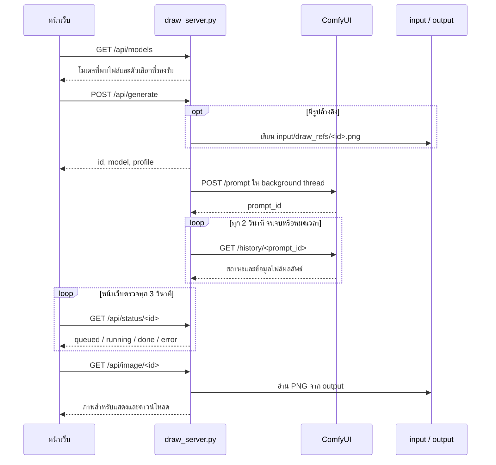

# ภาพรวมระบบ Thanipitak Agent

ผลศึกษาโค้ดล่าสุด commit `de58fb1` อยู่ใน [รายงานอัปเดตล่าสุด](SYSTEM_UPDATE_2026-09-29_de58fb1.md) ส่วนผลศึกษารุ่น `196f7e6` อยู่ใน [รายงานก่อนหน้า](SYSTEM_UPDATE_2026-09-29.md) และผลตรวจระบบออนไลน์ของ snapshot ก่อนหน้าอยู่ใน [รายงาน deployment](DEPLOYMENT_2026-09-29.md)

ศึกษาวันที่ 28 กันยายน 2026 จาก branch `main`, commit `28f5b2b1fe3a1b4e56b11742bb1f2fb81c60e521` ซึ่งตรงกับ remote `main` ขณะตรวจ

เอกสารนี้บันทึกพฤติกรรมของโค้ดปัจจุบันและจุดที่เกี่ยวข้องกับการแก้ไขครั้งต่อไป ข้อสังเกตในเอกสารยังไม่ได้ถูกแก้ในโค้ด

## 1. หน้าที่ของระบบ

เว็บภาษาไทยสำหรับสร้างภาพจากข้อความผ่าน ComfyUI ที่ติดตั้งแยกไว้ รองรับโมเดลที่กำหนดไว้สองรายการ คือ Qwen-Image-2.1 และ FLUX.2 [klein] 4B

หน้าเว็บใช้ HTML/CSS/JavaScript โดยตรง ส่วนเซิร์ฟเวอร์ใช้ Python standard library ไม่มีขั้นตอน build หน้าเว็บ ไม่มีฐานข้อมูล และไม่มีไฟล์ dependency สำหรับแพ็กเกจภายนอกใน repository นี้ README ระบุ Python 3.10 ขึ้นไป

## 2. แผนที่โค้ด

| ไฟล์ / ส่วน | หน้าที่และจุดเริ่มอ่าน |
|---|---|
| `index.html` | หน้าฟอร์ม ผลลัพธ์ CSS และ JavaScript อยู่ในไฟล์เดียว; script เริ่มที่บรรทัด 147 |
| `draw_server.py:19` | Environment variables, ชื่อไฟล์โมเดล, limits, `PROFILES`, `MODELS` |
| `draw_server.py:83` | `save_reference()` ตรวจและบันทึกรูปอ้างอิง |
| `draw_server.py:110` | `available_models()` และ `model_catalog()` |
| `draw_server.py:130` | `build_qwen_graph()`, `build_flux_graph()`, `build_graph()` สร้าง ComfyUI API graph |
| `draw_server.py:199` | `run_job()` ส่งงาน ตรวจ history และจัดการผลลัพธ์ |
| `draw_server.py:243` | `Handler` ให้บริการหน้าเว็บและ API |
| `tests/test_draw_server.py` | ทดสอบ graph และ HTTP รวม 5 รายการ |
| `deploy/systemd/qwen-draw@.service` | ตัวอย่าง service สำหรับ Linux |
| `.gitignore` | กันโมเดล รูปที่สร้าง รูปอัปโหลด environment files และ logs ออกจาก Git |

## 3. เส้นทางการทำงาน



- `JOBS` เป็น dictionary ใน process มี `threading.Lock` ป้องกันการเข้าถึงพร้อมกัน
- งานเปลี่ยนจาก `queued` เป็น `running` เมื่อ ComfyUI รับ prompt แล้ว จึงยังไม่ยืนยันว่า GPU เริ่มประมวลผลงานนั้น
- หลังส่ง prompt สำเร็จ รอ history สูงสุด 900 วินาที; คำขอไป ComfyUI แต่ละครั้งมี timeout 30 วินาที
- ใช้ภาพ output แรกที่พบใน history และเก็บชื่อไฟล์ไว้ในสถานะงาน
- เมื่อรับงานใหม่ จะลบรายการงานที่มีอายุเกินหนึ่งชั่วโมงออกจาก `JOBS`; ไม่มี timer ล้างงานแยก และไม่ลบไฟล์ภาพผลลัพธ์
- รูปอ้างอิงถูกลบใน `finally` ของ worker ทั้งกรณีสำเร็จและผิดพลาด; การปิด process แบบทันทีอาจทำให้ไฟล์ค้าง

## 4. โมเดลและ workflow

| รายการ | Qwen-Image-2.1 | FLUX.2 [klein] 4B |
|---|---|---|
| API model id | `qwen-image-2.1` | `flux.2-klein-4b` |
| Diffusion model | `diffusion_models/qwen-image-2.1-UC-Q4_K_M.gguf` | `diffusion_models/flux-2-klein-4b-fp8.safetensors` |
| Text encoder | `text_encoders/qwen3vl_8b_int8_convrot.safetensors` | `text_encoders/qwen_3_4b.safetensors` |
| VAE | `vae/qwen_image_2.1_vae_bf16.safetensors` | `vae/flux2-vae.safetensors` |
| Profile | `fast`: 16 steps / CFG 1; `medium`: 25 / 1; `quality`: 30 / 2.5 | `standard`: 4 steps / CFG 1 |
| Sampling | `KSampler`, Euler, simple scheduler | `SamplerCustomAdvanced`, Euler, `Flux2Scheduler` |
| รูปอ้างอิง | `LoadImage` → `TextEncodeQwenImage21` ผ่าน `images.image_1` และ VAE | เว็บนี้ไม่รองรับ |
| Negative prompt | ส่งเข้า graph; หน้าเว็บระบุว่าใช้ผลใน profile `quality` | เว็บนี้ปฏิเสธค่าที่ไม่ว่าง |

ความพร้อมที่แสดงใน catalog หมายถึงพบไฟล์ทั้งสามและแต่ละไฟล์มีขนาดมากกว่าศูนย์เท่านั้น โค้ดยังไม่ตรวจว่า ComfyUI โหลดไฟล์ได้หรือมี node ที่ workflow ต้องใช้ โดยเฉพาะ `UnetLoaderGGUF` และ `TextEncodeQwenImage21`

## 5. API และข้อกำหนด input

| Endpoint | พฤติกรรมปัจจุบัน |
|---|---|
| `GET /` หรือ `/index.html` | อ่านและส่ง `index.html` |
| `GET /api/health` | ส่ง `ok: true`, ชื่อไฟล์โมเดล Qwen และ model ids ที่พบไฟล์ |
| `GET /api/models` | ส่ง default model, label, availability, profiles และ capability flags |
| `POST /api/generate` | ตรวจ body, สร้าง graph, เริ่ม worker และคืน HTTP 200 พร้อม `id`, `profile`, `model` |
| `GET /api/status/<id>` | ส่งข้อมูลงาน; ถ้าไม่พบส่ง HTTP 200 พร้อม `status: unknown` |
| `GET /api/image/<id>` | ส่ง PNG; HTTP 404 ถ้ายังไม่มีชื่อไฟล์หรืออ่านไฟล์ไม่ได้ |

`POST /api/generate` รับ JSON ดังนี้:

- `prompt`: จำเป็น ความยาวหลัง trim 1–4,000 ตัวอักษร
- `model`: เริ่มต้น `qwen-image-2.1`; ต้องอยู่ใน `MODELS` และพบไฟล์โมเดลครบ
- `profile`: เริ่มต้นตามโมเดล; Qwen รับค่าเก่า `auto` แล้วแปลงเป็น `medium`
- `negative`: เริ่มต้นข้อความว่าง ยาวไม่เกิน 1,000 ตัวอักษร
- `resolution`: เริ่มต้น 1024; backend รับ 512, 640, 768, 896, 1024 และแทนค่าอื่นด้วย 1024; หน้าเว็บแสดง 512, 768, 1024
- `seed`: รับทาง API แต่ยังไม่มีช่องในหน้าเว็บ; ถ้าไม่ส่งจะใช้ค่าจากเวลา
- `reference`: image data URL ของ PNG/JPEG/WebP สำหรับ Qwen

Body ทั้งหมดจำกัด 12 MiB รูปอ้างอิงหลังถอด base64 จำกัด 10 MiB ส่วนหน้าเว็บรับไฟล์ต้นฉบับได้สูงสุด 15 MiB แล้วแปลงเป็น JPEG โดยย่อด้านยาวไม่เกิน 1536 pixels ก่อนส่ง ขนาดดิบ 10 MiB เมื่อแปลงเป็น base64 จะเกิน limit ของ body จึงส่งผ่าน API ไม่ได้เต็ม 10 MiB ตามที่ข้อความ error ระบุ

## 6. การตั้งค่าและการรัน

| Environment variable | ค่าเริ่มต้น |
|---|---|
| `COMFY_URL` | `http://127.0.0.1:8188` |
| `COMFY_HOME` | `~/ComfyUI` |
| `COMFY_MODEL_ROOT` | `<COMFY_HOME>/models` |
| `COMFY_INPUT_DIR` | `<COMFY_HOME>/input` |
| `COMFY_OUTPUT_DIR` | `<COMFY_HOME>/output` |
| `DRAW_HOST` | `127.0.0.1` |
| `DRAW_PORT` | `8190` |

ค่าเหล่านี้ถูกอ่านตอน import/start process จึงต้อง restart เซิร์ฟเวอร์เมื่อเปลี่ยน environment ส่วน `index.html` ถูกอ่านใหม่ทุกคำขอหน้าเว็บ

รันจากโฟลเดอร์ repository หลังตั้งค่า ComfyUI และติดตั้งโมเดลกับ nodes:

```powershell
$env:COMFY_HOME = 'C:\AI\ComfyUI'
$env:COMFY_URL = 'http://127.0.0.1:8188'
python .\draw_server.py
```

แม้ `COMFY_URL` เปลี่ยนไปยังเครื่องอื่นได้ โค้ดยังอ่าน input/output และตรวจโมเดลจาก filesystem ของเว็บเซิร์ฟเวอร์ การใช้ ComfyUI อีกเครื่องจึงต้องมี shared paths หรือปรับวิธีรับส่งไฟล์

ระบบยังไม่มี authentication ภายในและ bind loopback เป็นค่าเริ่มต้น README ระบุให้ใช้ authentication/reverse proxy เช่น Cloudflare Access เมื่อต้องเปิดใช้งานผ่านอินเทอร์เน็ต ใน repository ไม่มีการตั้งค่า tunnel หรือ Access ให้ตรวจสอบ

## 7. ข้อสังเกตสำหรับการแก้ไขต่อไป

| จุด | หลักฐานและผลต่อการใช้งาน |
|---|---|
| Health ยังไม่ยืนยันความพร้อมสร้างภาพ | `Handler.do_GET()` ไม่เรียก ComfyUI; smoke check ได้ `ok: true` แม้ไม่พบโมเดลและไม่มีบริการที่พอร์ตเริ่มต้น |
| สถานะงานไม่ถาวร | `JOBS` อยู่ในหน่วยความจำ; restart แล้วติดตามและดาวน์โหลดงานเดิมผ่าน id ไม่ได้ แม้ไฟล์ภาพยังอยู่; refresh หน้าเว็บก็ไม่มีการกู้ id เพราะไม่ได้เก็บใน browser storage |
| ไม่มีเพดานจำนวนงานในเว็บเซิร์ฟเวอร์ | `do_POST()` สร้าง daemon thread ใหม่ทุกงาน; การจำกัดคิวและจำนวนคำขอพร้อมกันยังไม่ได้ทำในชั้นนี้ |
| Timeout ไม่ยกเลิกงานใน ComfyUI | `run_job()` จบด้วย error และลบ reference แต่ไม่ส่งคำขอยกเลิก; หากงานยังรอคิวหรือทำงานอยู่ สถานะฝั่งเว็บกับ ComfyUI อาจต่างกัน |
| `seed=0` ถูกเปลี่ยนเป็นค่าสุ่ม | `draw_server.py:334` ใช้ `body.get("seed") or ...`; ควรแยกค่าศูนย์ออกจากกรณีไม่ส่งค่าเมื่อแก้เรื่อง reproducibility |
| ไม่ใช้ subfolder ของ output | `run_job()` เก็บเพียง `filename`; `/api/image/` อ่านจาก output root จึงต้องปรับหากเปลี่ยน graph ให้บันทึกภาพในโฟลเดอร์ย่อย |
| Linux service ใช้ `%h` | template ใช้ `%h` ใน WorkingDirectory, COMFY_HOME และ ExecStart แต่ README สั่งติดตั้งเป็น system service; ตามเอกสาร systemd `%h` ของ system manager เป็น `/root` และไม่เปลี่ยนตาม `User=%i` จึงต้องแก้ paths ก่อนใช้รูปแบบการติดตั้งนี้ |
| ข้อความและลิงก์บางส่วนผูกกับเครื่องเดิม | `index.html` ระบุ RTX 3060, เวลาโดยประมาณ และลิงก์ ComfyUI `https://draw.policeshield4.com/`; ไม่ได้ตรวจฮาร์ดแวร์หรืออ่านค่าจาก environment |

ข้อสังเกต systemd อ้างอิง [เอกสารต้นฉบับ systemd.unit ในโครงการ systemd](https://github.com/systemd/systemd/blob/main/man/systemd.unit.xml) ส่วนข้อสังเกตอื่นอ้างอิงโค้ดใน commit ที่ระบุด้านบน การทำงานของโมเดลจริงยังไม่ได้ยืนยันในเครื่องนี้

## 8. ผลตรวจและขอบเขตที่ยังไม่ยืนยัน

คำสั่งทดสอบ:

```powershell
python -m unittest discover -s tests -v
```

- ผ่านทั้งหมด 5 tests ด้วย Python 3.14.3: Qwen graph/reference, FLUX graph, catalog/model selection, การปฏิเสธตัวเลือกที่ไม่รองรับ/โมเดลไม่พร้อม และ UTF-8 ที่ไม่ถูกต้อง
- HTTP tests จำลองความพร้อมโมเดลและ mock `run_job()` จึงไม่ได้ยืนยันการเชื่อมต่อหรือการสร้างภาพผ่าน ComfyUI
- เปิดเซิร์ฟเวอร์ชั่วคราวบน loopback พอร์ตที่ OS เลือก และตรวจ `/`, `/api/health`, `/api/models`, `/api/status/nonexistent` สำเร็จ ก่อนปิดเซิร์ฟเวอร์
- ใน environment ที่ตรวจไม่มีการตั้งค่า `COMFY_*`/`DRAW_*`, ไม่พบ ComfyUI ที่ path เริ่มต้น, catalog ระบุทั้งสองโมเดล `available: false` และไม่พบ listener ที่พอร์ตเริ่มต้น 8188/8190
- ยังไม่ได้ทดสอบใน browser, การสร้างภาพจริงบน GPU, custom node compatibility, การ cleanup หลัง ComfyUI timeout หรือการติดตั้ง systemd บน Linux

## 9. เลือกจุดแก้ตามงาน

- เปลี่ยนหน้าตา/ข้อความ/ฟอร์ม: `index.html` และ payload ใน `generate()`
- เพิ่มโมเดล: constants, `MODELS`, graph builder, dispatch ใน `build_graph()` และ capability/profile handling ในหน้าเว็บ
- เปลี่ยน sampling/quality: `PROFILES` และ graph builders
- เพิ่มประวัติงาน/กู้หลัง refresh: โครงสร้าง `JOBS`, status/image API และการเก็บ job id ในหน้าเว็บ
- ปรับ readiness/queue/cancel: `model_catalog()`, health API, `do_POST()` และ `run_job()`
- เปลี่ยน deployment: environment variables, systemd template, paths และ authentication ที่วางหน้าระบบ
